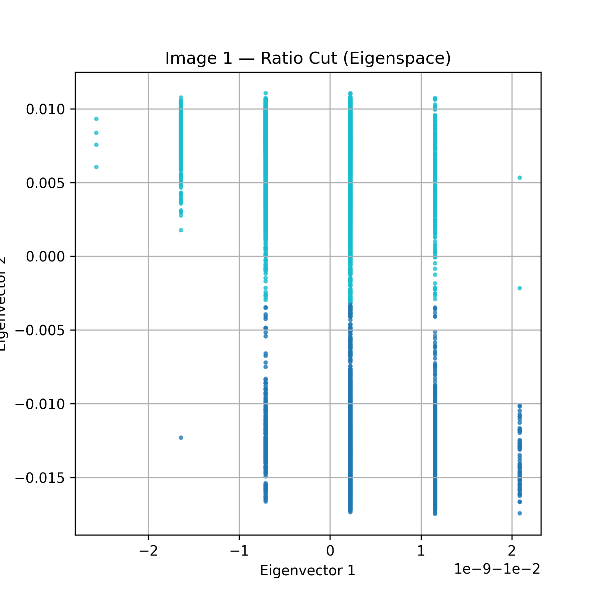
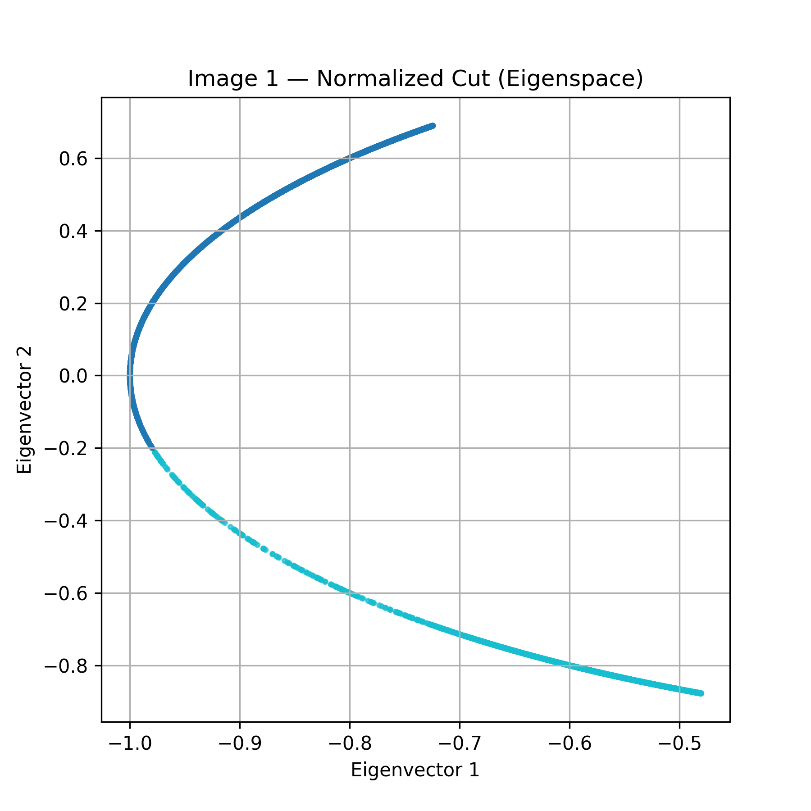
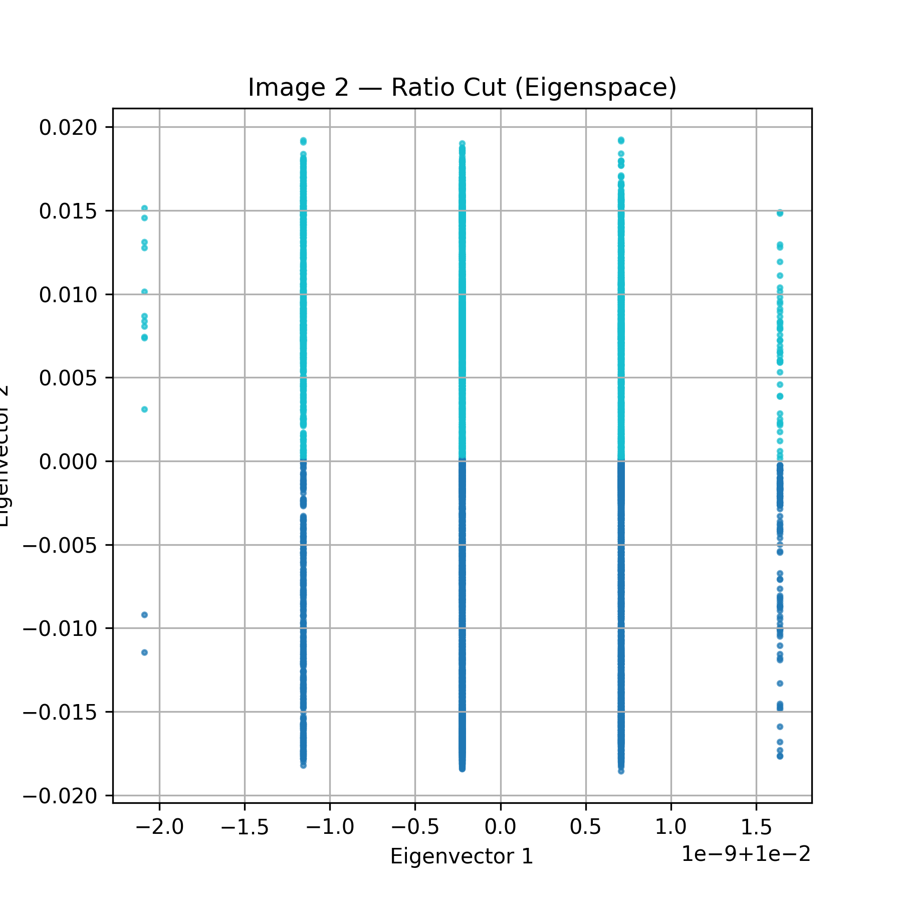
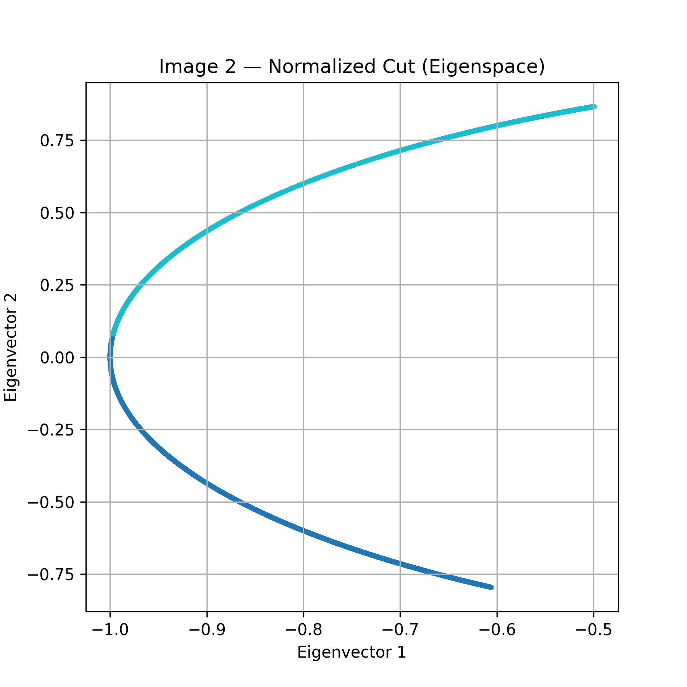

# spectral-image-segmentation
Image segmentation from scratch using Kernel K-Means, Ratio Cut, and Normalized Cut with NumPy, including K-Means++ initialization and eigenspace analysis.


# Image Segmentation with Kernel K-Means and Spectral Clustering

Graph-based image segmentation from scratch using **Kernel K-Means**, **Spectral Clustering (Ratio Cut and Normalized Cut)**, **K-Means++ initialization**, and **eigenspace analysis**, implemented using **NumPy only**.

## Overview

This project explores classical clustering-based approaches for **image segmentation** by treating each pixel as a data point and grouping pixels into coherent image regions.

Implemented methods:
- Kernel K-Means
- Spectral Clustering with **Ratio Cut**
- Spectral Clustering with **Normalized Cut**
- K-Means++ initialization
- Eigenspace visualization and analysis

The project compares how different clustering formulations behave on image segmentation tasks and studies their stability, sensitivity to initialization, and embedding geometry.

---

## Key Highlights

- Implemented all algorithms **from scratch**
- Used **NumPy only** without SciPy or scikit-learn
- Performed segmentation on two input images of size **100 × 100**
- Compared **random initialization** vs **K-Means++**
- Extended experiments to **multiple clusters** (`k = 3, 4`)
- Analyzed the eigenspace structure of Ratio Cut and Normalized Cut
- Visualized intermediate segmentation frames and generated GIFs

---

## Methods

### 1. Kernel K-Means
Kernel K-Means performs clustering in an implicit kernel-induced feature space. Instead of explicitly computing centroids, it updates cluster assignments using kernel-space distances.

This method works reasonably well when clusters are separable in the kernel space, but it is sensitive to initialization and often produces noisy boundaries.

### 2. Spectral Clustering — Ratio Cut
Ratio Cut uses the **unnormalized graph Laplacian**:

`L = D - W`

The smallest eigenvectors of the Laplacian are used as a low-dimensional embedding, and standard k-means is then applied in that eigenspace.

In this project, Ratio Cut was found to be unstable and sensitive to graph degree variations.

### 3. Spectral Clustering — Normalized Cut
Normalized Cut uses the **symmetric normalized Laplacian**:

`L_sym = I - D^(-1/2) W D^(-1/2)`

This normalization makes the spectral embedding more stable, especially when node degrees vary significantly.

Among all tested methods, Normalized Cut produced the cleanest and most reliable segmentations.

### 4. K-Means++ Initialization
K-Means++ was used to improve centroid initialization and reduce bad local minima.

It generally improved convergence speed and stability, especially for Kernel K-Means, while having less impact on Normalized Cut due to its already well-structured embedding.

---

## Experiment Setup

Unless otherwise stated, the following settings were used:

- Two input images: `image1.png` and `image2.png`
- Image size: `100 × 100`
- Spatial coordinates normalized to `[0, 1]`
- RGB colors normalized to `[0, 1]`
- Maximum k-means iterations: `20`

The kernel used for both Kernel K-Means and Spectral Clustering is:

`k(x_i, x_j) = exp(-γ_s ||S_i - S_j||^2) * exp(-γ_c ||C_i - C_j||^2)`

where:
- `γ_s = 0.001`
- `γ_c = 0.001`

GIFs were generated from saved segmentation frames to visualize convergence across iterations.

---

## Main Findings

### Kernel K-Means
- Converges in relatively few iterations
- Sensitive to initialization and kernel hyperparameters
- Often produces noisy boundaries
- Tends to over-segment when the number of clusters increases

### Ratio Cut
- Weakest performer overall
- Produces unstable segmentations
- Eigenspace collapses into distorted vertical-band-like structures
- Performs especially poorly on more complex images

### Normalized Cut
- Strongest and most robust method
- Produces clean, contiguous image regions
- Less sensitive to initialization
- Maintains meaningful segmentation even as `k` increases

### Initialization Effects
- K-Means++ improves Kernel K-Means noticeably
- Ratio Cut benefits only slightly from K-Means++
- Normalized Cut is already stable, so both random and K-Means++ give similar final results

---

## Eigenspace Analysis

A major part of this project is analyzing the spectral embedding produced by graph Laplacians.

- **Ratio Cut** produced distorted eigenspaces that collapsed into nearly vertical bands, making cluster structure unclear.
- **Normalized Cut** produced smooth 1D manifold-like embeddings, where clusters occupied contiguous regions along the curve.

This eigenspace behavior explains why Normalized Cut consistently gave better segmentation quality than Ratio Cut.

---

## Project Structure
## Project Structure

```text
spectral-image-segmentation/
├── kernel_kmeans_image1.png
├── kernel_kmeans_image2.png
├── ratio_cut_image1.png
├── ratio_cut_image2.png
├── normalized_cut_image1.png
├── normalized_cut_image2.png
├── ratio_cut_eigenspace_image1.png
├── ratio_cut_eigenspace_image2.png
├── normalized_cut_eigenspace_image1.png
├── normalized_cut_eigenspace_image2.png
├── gifs/
│   ├── img1_kkm.gif
│   ├── img2_kkm.gif
│   ├── img1_ratio.gif
│   ├── img2_ratio.gif
│   ├── img1_ncut.gif
│   └── img2_ncut.gif
├── notebooks/
│   └── image_segmentation.ipynb
├── report/
│   └── report.pdf

```
---

## Visual Results
1. Kernel K-Means
    Kernel K-Means can segment the main regions of an image, but the final output may contain noisy boundaries and fragmented patches near object edges.

2. Ratio Cut
    Ratio Cut often produces unstable intermediate segmentations and distorted eigenspace geometry, making it the least reliable method in this project.

3. Normalized Cut
    Normalized Cut gives the cleanest segmentations and the most stable boundaries. It consistently respects image structure better than the other methods.


---

## Eigenspace Analysis

The eigenspace plots below illustrate the difference between **Ratio Cut** and **Normalized Cut**.  
While Ratio Cut produces distorted embeddings with poor geometric separation, Normalized Cut forms a smooth manifold that leads to more stable clustering.

### Image 1
| Ratio Cut | Normalized Cut |
|---|---|
|  |  |

### Image 2
| Ratio Cut | Normalized Cut |
|---|---|
|  |  |

---
